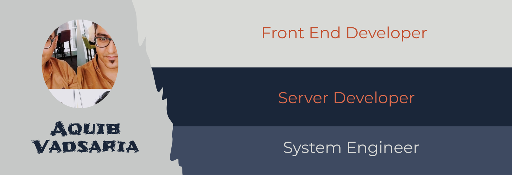

## Heya, I am
<!--
# Aquib Vadsaria 
### A System Engineer turned Full Stack Javascript Engineer with strong frontend experience.
-->

With over 12 years of experience, I have worked across developing production-ready servers, UI Web & mobile applications to configuring mainframe servers in startup and enterprise organizations.
I am always excited to learn new technologies and harvest my learning in developing exciting and challenging applications.

<h2 align="center"> Technologies I work with </h2>
<h3 align="center">UI Technologies</h3>
  

    
  

  <h3 align="center">Server Technologies</h3>
  

    
  

  <h3 align="center">Cloud Technologies</h3>
  

    
  

<h2 align="center"> Certifications </h2>

  
  

